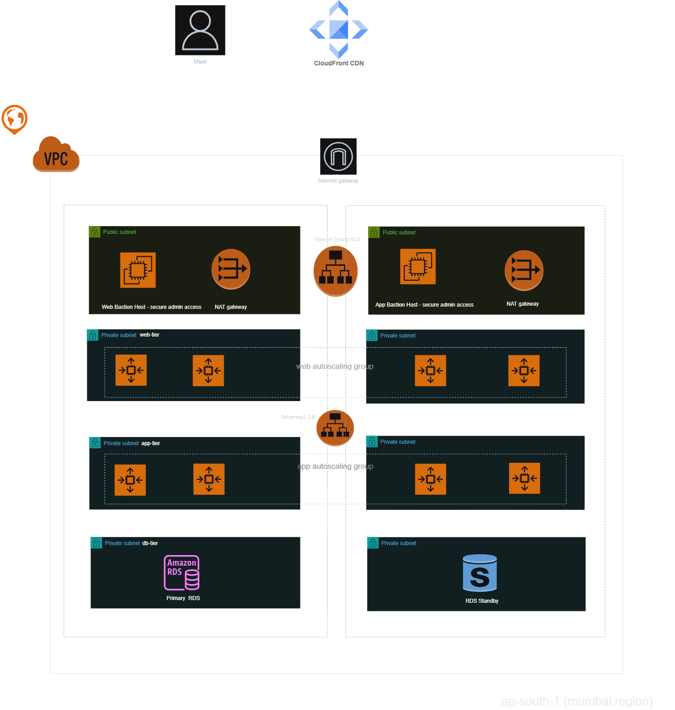
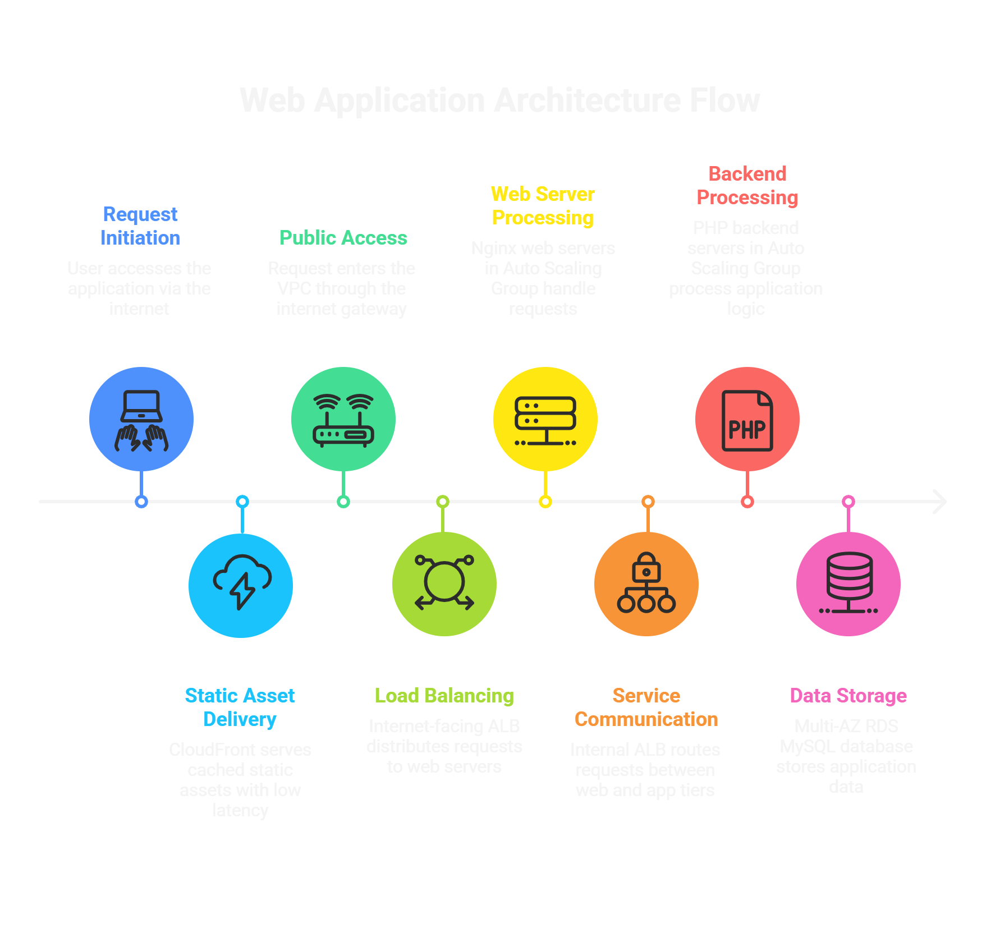

# 3-Tier-AWS-webapp-Architecture

## Project Overview
This project demonstrates a **production-ready 3-tier architecture on AWS** by building a scalable and secure **Job Application Portal**.

The architecture is secure by design, fault tolerant, and can automatically scale to handle variable user traffic, with zero direct public exposure of backend and database workloads.

The project highlights real-world implementation of cloud and DevOps practices, including load balancing, CDN integration, private subnet design, and monitoring with CloudWatch and SNS.


### This project demonstrates hands-on implementation of:

- Multi Availability Zone (Multi-AZ) high availability design
- Load balancing for stateless workloads
- Auto scaling to match infrastructure capacity to user traffic
- Network security with public / private subnet segmentation
- CDN integration for improved end user performance
- Proactive monitoring and automated alerting

---

##  Architecture Diagram



##  Architecture Flow



---
## Project Structure

```
3TIER-AWS-WEBAPP
    ├── app
    │   ├── config.demo.php
    │   ├── config.php
    │   └── submit.php
    ├── architecture
    │   ├── 3-tier-aws.png
    │   └── 3-tier-flow.png
    ├── docs
    │   ├── architecture.md
    │   ├── deployment.md
    │   └── setup.md
    ├── nginx
    │   └── web.conf
    ├── screenshot
    │   ├── 3-tier-vpc-resource-map.png
    │   ├── store-database.png
    │   └── webapp-ui.png
    ├── web
    │   ├── assets
    │   │   ├── css
    │   │   │   └── style.css
    │   │   └── js
    │   │       └── script.js
    │   └── index.html
    ├── .gitignore
    ├── .hintrc
    └── README.md
```

## Features

| Feature                                   | Business / Technical Benefit |
|------------------------------------------|------------------------------|
| Layered 3-Tier Architecture              | Clear separation of concerns and allows independent scaling of each tier |
| Auto Scaling Groups (Web & App Tier)     | Automatically scales resources based on traffic, optimizing performance and cost |
| AMI-based Instance Provisioning          | Ensures fast, consistent, and repeatable deployment of servers |
| Private Subnet Deployment (Backend)      | Application and database are not publicly exposed, improving security |
| CloudFront CDN                           | Reduces latency and improves user experience by caching content globally |
| Monitoring & Alerting (CloudWatch + SNS) | Enables early issue detection and minimizes downtime |
| Encryption (At Rest & In Transit)        | Protects sensitive user data and ensures secure communication |

---

## Tech Stack

| Category              | Technologies Used |
|----------------------|------------------|
| AWS Cloud     | VPC, EC2, Auto Scaling Groups, Application Load Balancers, CloudFront, RDS (MySQL), CloudWatch, SNS |
| Frontend           |  HTML, CSS, JavaScript (Responsive UI) |
| Backend          | PHP |
| Web Server        | Nginx |

---

## project screenshot
[project ui, vpc resouce map & data storage](screenshot)

## Future Enhancements - DevOps

This is a living project, next improvements planned:

| Area                     | Enhancement                                   | Description |
|--------------------------|----------------------------------------------|-------------|
| CI/CD                 | Jenkins                      | Automate build, test, and deployment for faster and reliable releases |
| Infrastructure as Code | Terraform                                    | Provision AWS infrastructure (VPC, ALB, ASG, RDS) using code |
| Configuration         | Ansible                                     | Automate server setup and configuration across environments |
| Containerization      | Docker                                      | Package application into containers for consistency |
| Orchestration         | Kubernetes                             | Manage and scale containerized applications |
| Monitoring            | Prometheus / Grafana           | Advanced monitoring, logging, and alerting |


## Author
**Satish Pathade**  
AWS Cloud & DevOps Engineer


